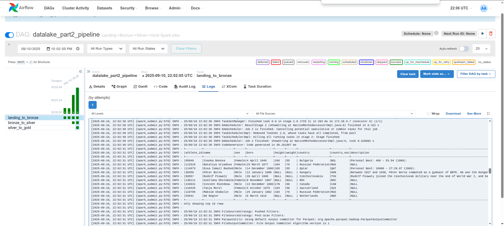
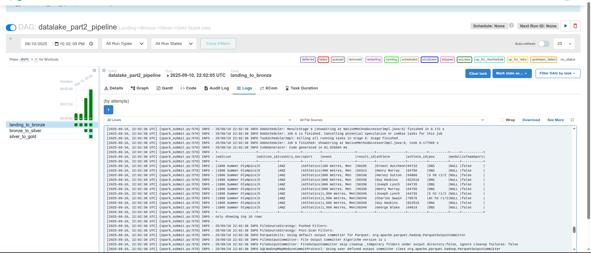
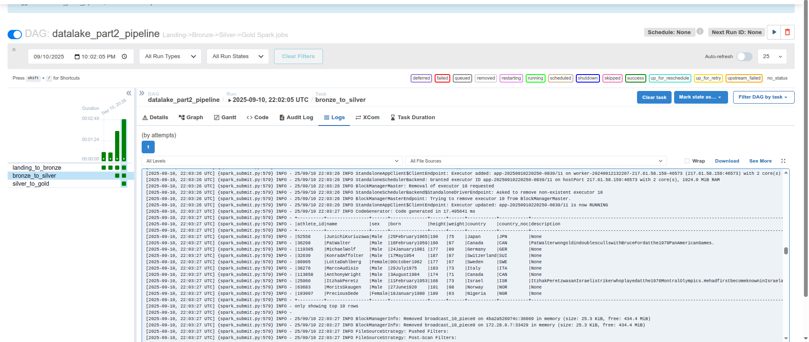
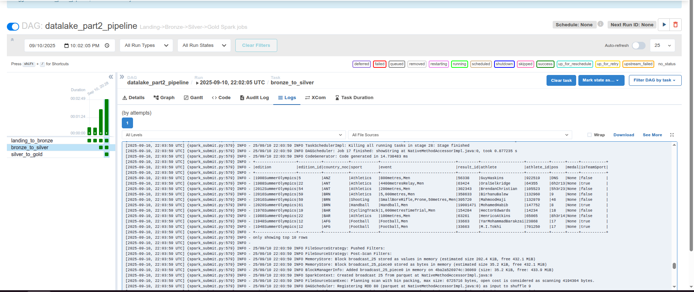
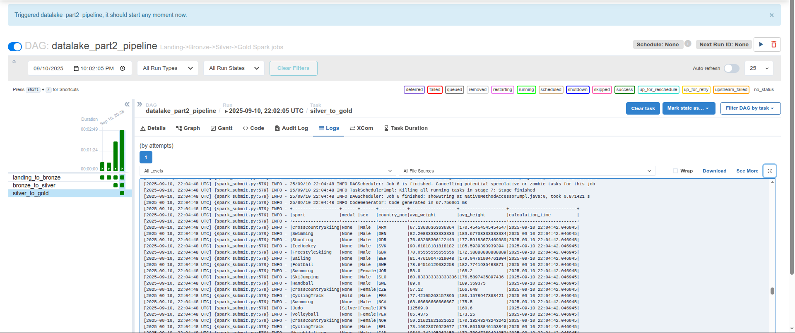
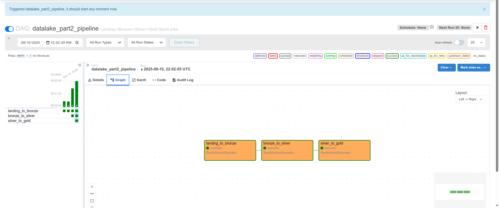

# Частина 1. Building an End-to-End Streaming Pipeline  
  
  

# Частина 2. Building an End-to-End Batch Data Lake
## Landing to bronze athletes and results tables    
  
  

## Bronze to silver atheletes and results tables  
  
  

## Silver to gold average statistics table  
  

## DAG's graph  
  
